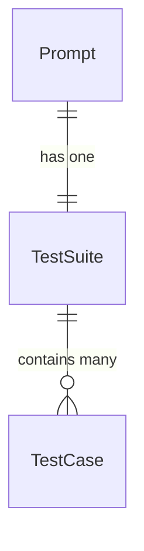

# README

A rails and react app that provides a daily coding prompt in Ruby.
Deployed using Docker on a raspberry pi.

[Try it out](https://roodlegame.com/)
 
## Overview

Roodle provides a daily coding prompt to help users sharpen their skills in Ruby. The UI is loosely modeled after Wordle, with five test cases showing red, green or yellow to indicate a failing, passing or exception-raising test case, respectively.

## Data Models

## Features

- Daily coding prompt
- In-browser code editor (via [CodeMirror](https://codemirror.net/))
- Responsive design - works on mobile as well
- Progess tracking over time - coming soon!

## Tech Stack

- Frontend: React.js, JavaScript, HTML, CSS, Material UI v5 with Emotion
- Backend: Ruby on Rails API
- Database: PostgreSQL
- Containerization: Docker
- Deployment: Raspberry Pi

## Installation

Install front end dependencies
`npm install`

This project includes an .nvmrc file so if using nvm, you can do
`nvm use`
to grab the correct node version

Install backend dependencies
`bundle install`

## Running Locally

Spin up the app
`bin/dev`

## TODO

1. [DONE] Parse code before sending it to Piston so it runs properly 
2. [] Refactor so that only one api call needs to be made
3. [DONE] In UI, show user that call has been made and is waiting for response, disable button
4. [] Write tests
5. [] Add upload process for data - rake task that ingests prompt data
6. [] No need to store anything from the user - that should all be in localStorage - get rid of submissions table?
7. [] Create UI to display historical prompt attempts
8. [] Allow user to navigate to previous day's prompt and attempt results
9. Add solve() with the input arg? - stick to one name, one arg for now - add more later?
