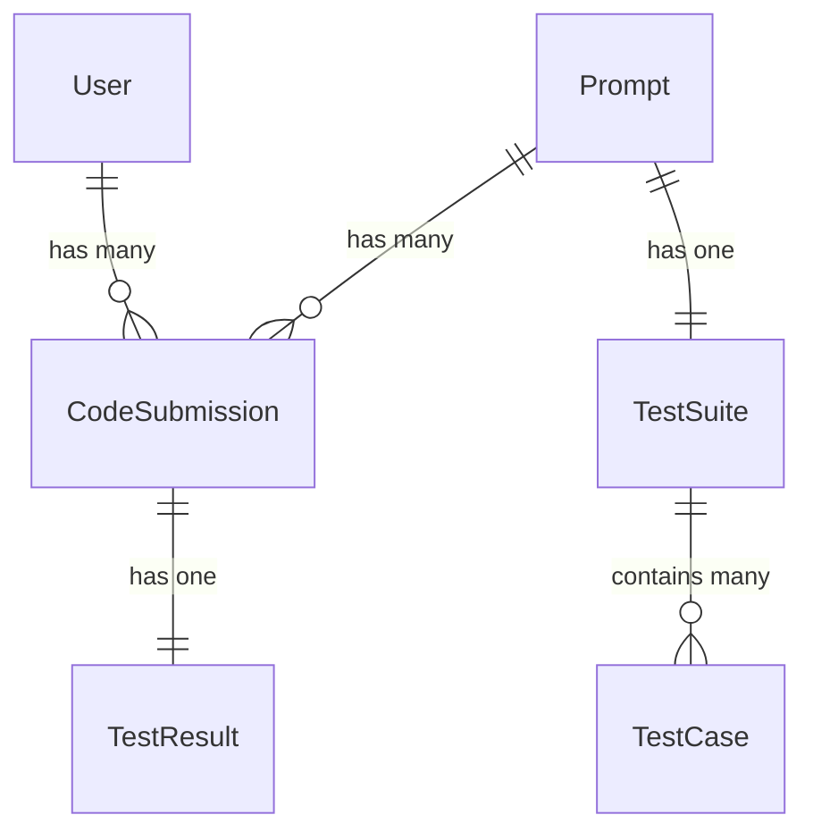

# README

Data Models

## Installation

Install front end dependencies
`npm install`

Install backend dependencies
`bundle install`

Spin up the app
`bin/dev`

## TODO

1. Parse code before sending it to Piston so it runs properly
2. Refactor so that only one api call needs to be made
3. In UI, show user that call has been made and is waiting for response, disable button