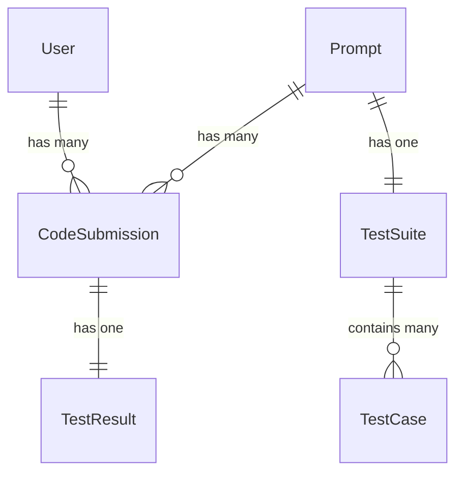

# README

Data Models

```mermaid
erDiagram
User ||--o{ CodeSubmission : "has many"
Prompt ||--o{ CodeSubmission : "has many"
Prompt ||--|| TestSuite : "has one"
TestSuite ||--o{ TestCase : "contains many"
CodeSubmission ||--|| TestResult : "has one"
```