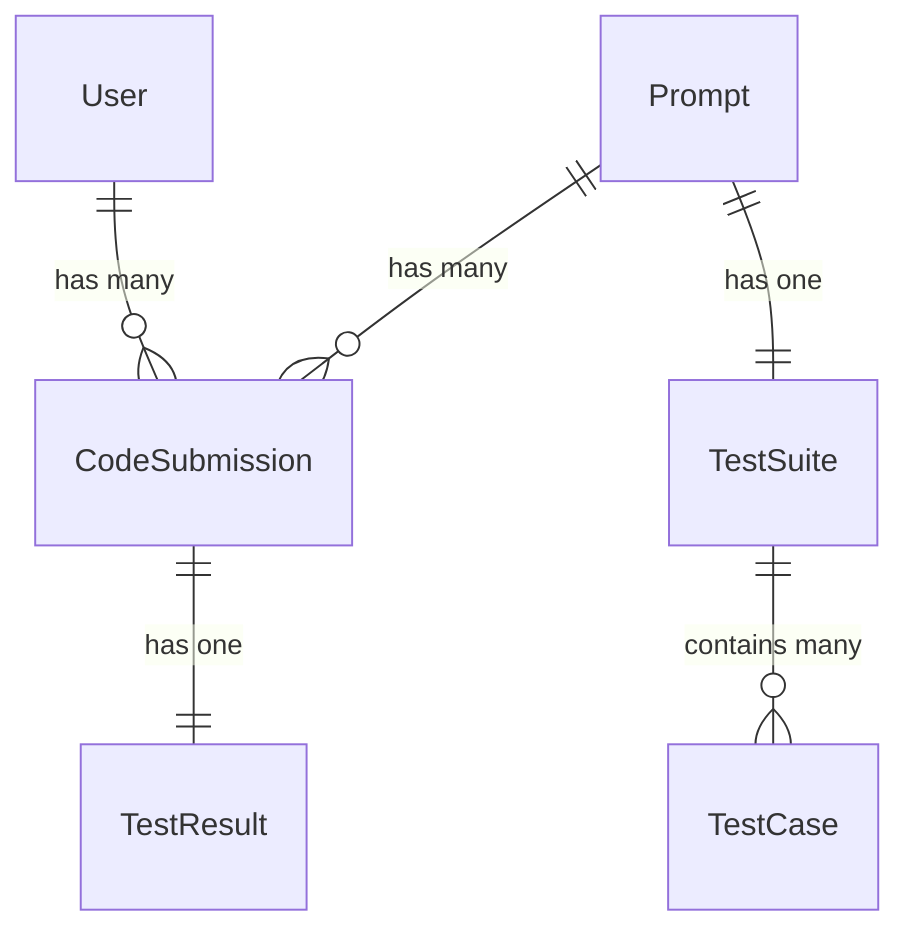

# README

Data Models

## Installation

Install front end dependencies
`npm install`

Install backend dependencies
`bundle install`

Spin up the app
`bin/dev`

## TODO

1. [DONE] Parse code before sending it to Piston so it runs properly 
2. [] Refactor so that only one api call needs to be made
3. [DONE] In UI, show user that call has been made and is waiting for response, disable button
4. [] Write tests
5. [] Add upload process for data - rake task that ingests prompt data
6. [] No need to store anything from the user - that should all be in localStorage - get rid of submissions table?
7. [] Create UI to display historical prompt attempts
8. [] Allow user to navigate to previous day's prompt and attempt results
9. Add solve() with the input arg? - stick to one name, one arg for now - add more later?
