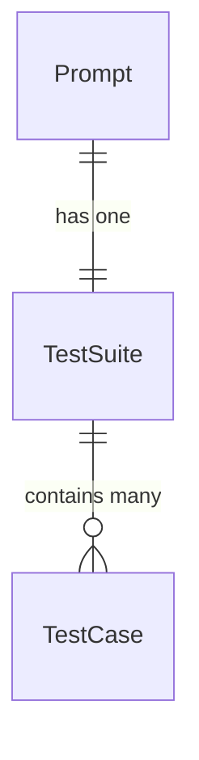

# README

A rails and react app that provides a daily coding prompt in Ruby.
Deployed using Docker on a raspberry pi.

[Try it out](https://roodlegame.com/)

## Current Version

4
 
## Overview

Roodle provides a daily coding prompt to help users sharpen their skills in Ruby. The UI is loosely modeled after Wordle, with five test cases showing red, green or yellow to indicate a failing, passing or exception-raising test case, respectively.


## Data Models



## Features

- Daily coding prompt
- In-browser code editor (via [CodeMirror](https://codemirror.net/))
- Responsive design - works on mobile as well
- Progess tracking over time - coming soon!

## Tech Stack

- Frontend: React.js, JavaScript, HTML, CSS, Material UI v5 with Emotion
- Backend: Ruby on Rails API
- Database: PostgreSQL
- Containerization: Docker
- Deployment: Raspberry Pi

## Installation

Install front end dependencies
`npm install`

This project includes an .nvmrc file so if using nvm, you can do
`nvm use`
to grab the correct node version

Install backend dependencies
`bundle install`

## Running Locally

Spin up the app
`bin/dev`

## Deployment

Roodle is currently deployed on my personal raspberry pi using docker and hosted through a Cloudflare tunnel. These are the steps I use to update the live application.

Steps to make changes:
1. Get on the branch you want to push up
2. Create a new docker build with a new version number and the correct build name. See current version at top of this document. *Don't forget to specify the architecture as arm which is compatible with raspberry pi. Use buildx*
```
docker buildx build \
  --platform linux/arm64 \
  --provenance=false \
  -t shacon/roodle:arm-{BUILD_NAME}-v{VERSION} \
  -f Dockerfile.dev \
  --push \
  .
  ```
3. Push the image to docker hub -  `docker push shacon/roodle:{BUILD_NAME}-v{VERSION}`
4. Ssh into raspberry pi
5. Navigate to root of app which holds docker-compose.yml
6. Pull the image `docker-compose pull shacon/roodle:{BUILD_NAME}-v{VERSION}`
7. Modify image name on pi's docker-compose.yml
8. Restart the application with the new image 
`docker-compose down
docker-compose up -d
`

## Data
Right now, I have a rake task that imports new prompt data. On my pi, I run:
`docker-compose exec app bin/rake ingest_prompt_data`

## Checking CloudFlare Tunnels
List tunnels
`cloudflared tunnel list`
Check config file

Restart tunnel
`sudo systemctl restart cloudflared`

Verify tunnel config
`cloudflared tunnel route dns roodle-tunnel roodlegame.com`

Test tunnel
`cloudflared tunnel test`

## TODO

1. [DONE] Parse code before sending it to Piston so it runs properly 
2. [] Refactor so that only one api call needs to be made
3. [DONE] In UI, show user that call has been made and is waiting for response, disable button
4. [] Write tests
5. [DONE] Add upload process for data - rake task that ingests prompt data
6. [DONE] No need to store anything from the user - that should all be in localStorage - get rid of submissions table?
7. [] Create UI to display historical prompt attempts
8. [] Allow user to navigate to previous day's prompt and attempt results
9. [DONE ]Add solve() with the input arg? - stick to one name, one arg for now - add more later?
10. [] Allow user to save their results in easily shareable copy
